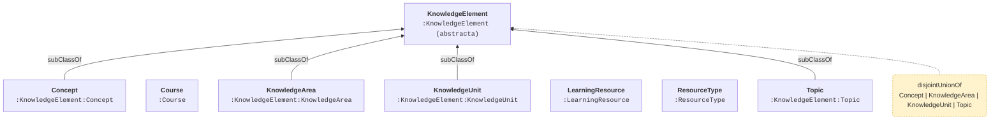
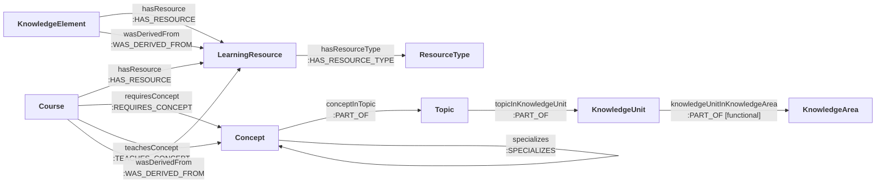

# T-box de la ontología, proyectada al modelo de Neo4j

**Artefacto generado.** No editar a mano: lo emite
`lab/scripts/emit_tbox_diagram.py` desde `ontology/ontologia_informatica.ttl`
y `schema/schema_rules.yaml`. Se regenera con
`uv run python lab/scripts/emit_tbox_diagram.py`.

La T-box **no está materializada en Neo4j**: las etiquetas y los tipos de
arista ya identifican clase y propiedad. Lo que las etiquetas no pueden
cargar —disyunción, cardinalidad, transitividad, inversas— vive aquí.

## 1. Jerarquía de clases

Cada caja muestra la clase OWL y el juego de etiquetas al que se proyecta.

## 2. Propiedades de objeto

Sólo las materializadas: una inversa dibujaría el mismo hecho dos veces.

## 3. Mapeo completo OWL → LPG

| Propiedad OWL | Dominio | Rango | En el grafo | Estado |
|---|---|---|---|---|
| `conceptInTopic` | Concept | Topic | `-[:PART_OF]->` | se escribe |
| `conceptRequiredBy` | Concept | Course | `-[:REQUIRES_CONCEPT]->` | no se escribe: se recorre al revés |
| `conceptTaughtBy` | Concept | Course | `-[:TEACHES_CONCEPT]->` | no se escribe: se recorre al revés |
| `hasPart` | — | — | `-[:PART_OF]->` | no se escribe: se recorre al revés |
| `hasPrerequisite` | Concept | Concept | `-[:HAS_PREREQUISITE]->` | se escribe |
| `hasResource` | Course, KnowledgeElement | LearningResource | `-[:HAS_RESOURCE]->` | se escribe |
| `hasResourceType` | LearningResource | ResourceType | `-[:HAS_RESOURCE_TYPE]->` | se escribe |
| `hasSpecialization` | Concept | Concept | `-[:SPECIALIZES]->` | no se escribe: se recorre al revés |
| `isAbout` | LearningResource | Course, KnowledgeElement | `-[:HAS_RESOURCE]->` | no se escribe: se recorre al revés |
| `isPartOf` | KnowledgeElement | KnowledgeElement | `-[:PART_OF]->` | no se escribe: se recorre al revés |
| `isPrerequisiteFor` | Concept | Concept | `-[:HAS_PREREQUISITE]->` | no se escribe: se recorre al revés |
| `knowledgeUnitInKnowledgeArea` | KnowledgeUnit | KnowledgeArea | `-[:PART_OF]->` | se escribe |
| `requiresConcept` | Course | Concept | `-[:REQUIRES_CONCEPT]->` | se escribe |
| `specializes` | Concept | Concept | `-[:SPECIALIZES]->` | se escribe |
| `teachesConcept` | Course | Concept | `-[:TEACHES_CONCEPT]->` | se escribe |
| `topicInKnowledgeUnit` | Topic | KnowledgeUnit | `-[:PART_OF]->` | se escribe |
| `wasDerivedFrom` | Course, KnowledgeElement | LearningResource | `-[:WAS_DERIVED_FROM]->` | se escribe |

## 4. Axiomas sin contraparte nativa

Ninguno de estos existe como restricción en Neo4j (ver `findings/0001`:
sólo la unicidad sobrevive a Community). Se comprueban con las consultas
de integridad de `build/integrity/`.

- `KnowledgeElement` es **unión disjunta** de `Concept`, `KnowledgeArea`, `KnowledgeUnit`, `Topic`: todo individuo lleva exactamente una de esas etiquetas.
- **Disjuntas entre sí**: `Concept`, `KnowledgeArea`, `KnowledgeUnit`, `Topic`.
- **Disjuntas entre sí**: `Course`, `KnowledgeElement`, `LearningResource`, `ResourceType`.
- `hasPart` es una propiedad transitiva → `PART_OF`.
- `hasPrerequisite` es una propiedad transitiva → `HAS_PREREQUISITE`.
- `isPartOf` es una propiedad transitiva → `PART_OF`.
- `isPrerequisiteFor` es una propiedad transitiva → `HAS_PREREQUISITE`.
- `knowledgeUnitInKnowledgeArea` es una propiedad funcional → `PART_OF`.
- Todo `Concept` está en al menos un `Topic` vía `conceptInTopic` (existencial; bajo mundo abierto el razonador no lo detecta).
- Todo `KnowledgeUnit` está en al menos un `KnowledgeArea` vía `knowledgeUnitInKnowledgeArea` (existencial; bajo mundo abierto el razonador no lo detecta).
- Todo `Topic` está en al menos un `KnowledgeUnit` vía `topicInKnowledgeUnit` (existencial; bajo mundo abierto el razonador no lo detecta).
