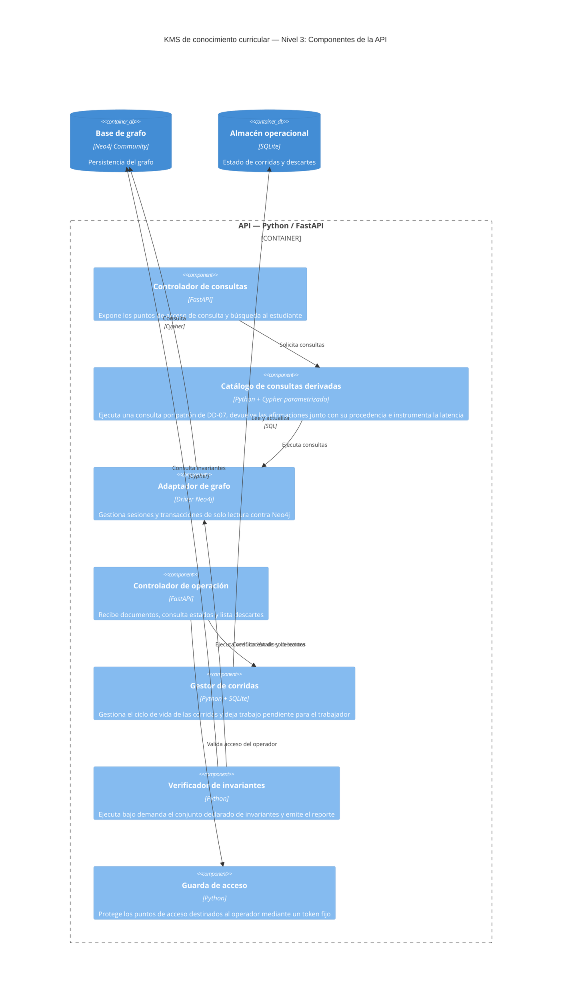

# Nivel Componentes C4 - KMS para el descubrimiento de recursos en Ingeniería Informática

## API

```mermaid
C4Component
title KMS de conocimiento curricular — Nivel 3: Componentes de la API

Container_Boundary(api, "API — Python / FastAPI") {

    Component(queryController, "Controlador de consultas", "FastAPI", "Expone los puntos de acceso de consulta y búsqueda al estudiante")

    Component(queryCatalog, "Catálogo de consultas derivadas", "Python + Cypher parametrizado", "Ejecuta una consulta por patrón de DD-07, devuelve las afirmaciones junto con su procedencia e instrumenta la latencia")

    Component(graphAdapter, "Adaptador de grafo", "Driver Neo4j", "Gestiona sesiones y transacciones de solo lectura contra Neo4j")

    Component(operationController, "Controlador de operación", "FastAPI", "Recibe documentos, consulta estados y lista descartes")

    Component(runManager, "Gestor de corridas", "Python + SQLite", "Gestiona el ciclo de vida de las corridas y deja trabajo pendiente para el trabajador")

    Component(invariantVerifier, "Verificador de invariantes", "Python", "Ejecuta bajo demanda el conjunto declarado de invariantes y emite el reporte")

    Component(accessGuard, "Guarda de acceso", "Python", "Protege los puntos de acceso destinados al operador mediante un token fijo")
}

ContainerDb(neo4j, "Base de grafo", "Neo4j Community", "Persistencia del grafo")
ContainerDb(sqlite, "Almacén operacional", "SQLite", "Estado de corridas y descartes")

Rel(queryController, queryCatalog, "Solicita consultas")
Rel(queryCatalog, graphAdapter, "Ejecuta consultas")
Rel(graphAdapter, neo4j, "Consulta", "Cypher")

Rel(operationController, accessGuard, "Valida acceso del operador")
Rel(operationController, runManager, "Gestiona corridas y descartes")

Rel(runManager, sqlite, "Lee y actualiza", "SQL")
Rel(invariantVerifier, graphAdapter, "Ejecuta verificación de solo lectura")
Rel(invariantVerifier, neo4j, "Consulta invariantes", "Cypher")

Rel(operationController, runManager, "Consulta estado y descartes")
```

## Trabajador de construcción del grafo

```mermaid
C4Component
title KMS de conocimiento curricular — Nivel 3: Trabajador de construcción del grafo

Container_Boundary(worker, "Trabajador de construcción del grafo — Python") {

    Component(runCoordinator, "Coordinador de corridas", "Python", "Reclama corridas pendientes, marca estados, encadena ejecuciones y termina cuando no queda trabajo")

    Component(documentConverter, "Conversor de documentos", "Docling", "Convierte documentos PDF en texto estructurado")

    Component(contextRetriever, "Recuperador de contexto", "Python + Neo4j", "Recupera el subgrafo relevante para anclar la extracción al contenido existente")

    Component(llmExtractor, "Extractor asistido por modelo de lenguaje", "Python + PydanticAI", "Emite hechos candidatos estructurados; único consumidor del proveedor externo")

    Component(conformanceValidator, "Validador de conformidad", "Python", "Valida cada hecho candidato contra el esquema versionado derivado de la T-Box")

    Component(entityLinker, "Enlazador de entidades", "Python + Neo4j", "Resuelve cada entidad contra nodos existentes de ambas capas sin modificar la capa de referencia")

    Component(transactionWriter, "Escritor transaccional", "Python + Cypher", "Genera y ejecuta la escritura con procedencia dentro de una única transacción")

    Component(invariantVerifier, "Verificador de invariantes", "Python + Cypher", "Ejecuta las invariantes dentro de la transacción antes de confirmar; una violación provoca rollback")

    Component(discardRegistry, "Registro de descartes", "Python + SQLite", "Registra descartes del validador, enlazador y verificador con motivo y restricción")

    Component(artifactManager, "Gestor de artefactos", "Python", "Carga la capa de referencia, vuelca hechos institucionales validados y ejecuta la reproyección")
}

ContainerDb(neo4j, "Base de grafo", "Neo4j Community", "Persistencia del grafo")
ContainerDb(sqlite, "Almacén operacional", "SQLite", "Estado de corridas y descartes")
Container(artifacts, "Repositorio de artefactos", "Sistema de archivos versionado", "Tabla del backbone y hechos institucionales validados")

System_Ext(llm, "Proveedor de modelo de lenguaje", "Servicio externo de modelo de lenguaje")

Rel(runCoordinator, sqlite, "Reclama y actualiza corridas", "SQL")

Rel(runCoordinator, documentConverter, "Orquesta ingesta")
Rel(documentConverter, contextRetriever, "Entrega texto estructurado")

Rel(contextRetriever, neo4j, "Recupera subgrafo relevante", "Cypher")
Rel(contextRetriever, llmExtractor, "Entrega contexto")

Rel(llmExtractor, llm, "Solicita extracción estructurada")
Rel(llm, llmExtractor, "Devuelve hechos candidatos")

Rel(llmExtractor, conformanceValidator, "Entrega hechos candidatos")

Rel(conformanceValidator, entityLinker, "Entrega hechos conformes")
Rel(conformanceValidator, discardRegistry, "Registra descartes")

Rel(entityLinker, neo4j, "Consulta entidades existentes", "Cypher")
Rel(entityLinker, transactionWriter, "Entrega entidades enlazadas")
Rel(entityLinker, discardRegistry, "Registra descartes")

Rel(transactionWriter, invariantVerifier, "Solicita verificación dentro de la transacción")
Rel(transactionWriter, neo4j, "Escribe hechos y procedencia", "Cypher")

Rel(invariantVerifier, neo4j, "Evalúa invariantes", "Cypher")
Rel(invariantVerifier, discardRegistry, "Registra violaciones")

Rel(runCoordinator, artifactManager, "Orquesta carga y reproyección")
Rel(artifactManager, artifacts, "Lee/escribe artefactos versionados")

Rel(artifactManager, neo4j, "Carga/reproyecta el grafo", "Cypher")

Rel(discardRegistry, sqlite, "Persiste descartes", "SQL")
```