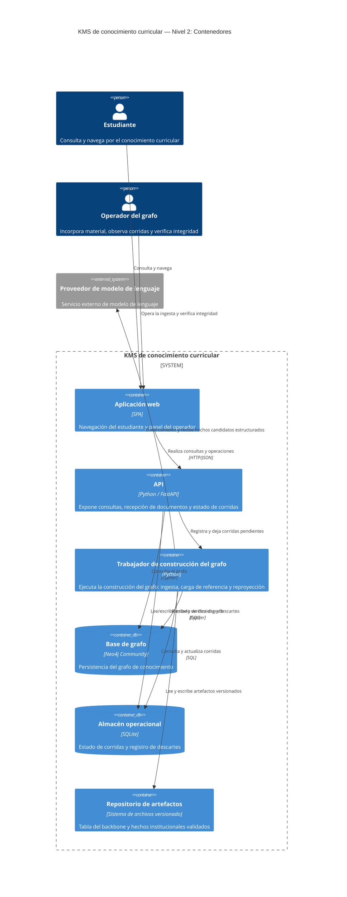

# Nivel Contenedores C4 - KMS para el descubrimiento de recursos en Ingeniería Informática

```mermaid
C4Container
title KMS de conocimiento curricular — Nivel 2: Contenedores

Person(student, "Estudiante", "Consulta y navega por el conocimiento curricular")
Person(operator, "Operador del grafo", "Incorpora material, observa corridas y verifica integridad")

System_Ext(llm, "Proveedor de modelo de lenguaje", "Servicio externo de modelo de lenguaje")

System_Boundary(kms, "KMS de conocimiento curricular") {

    Container(web, "Aplicación web", "SPA", "Navegación del estudiante y panel del operador")

    Container(api, "API", "Python / FastAPI", "Expone consultas, recepción de documentos y estado de corridas")

    Container(worker, "Trabajador de construcción del grafo", "Python", "Ejecuta la construcción del grafo: ingesta, carga de referencia y reproyección")

    ContainerDb(neo4j, "Base de grafo", "Neo4j Community", "Persistencia del grafo de conocimiento")

    ContainerDb(sqlite, "Almacén operacional", "SQLite", "Estado de corridas y registro de descartes")

    Container(artifacts, "Repositorio de artefactos", "Sistema de archivos versionado", "Tabla del backbone y hechos institucionales validados")
}

Rel(student, web, "Consulta y navega")
Rel(operator, web, "Opera la ingesta y verifica integridad")

Rel(web, api, "Realiza consultas y operaciones", "HTTP/JSON")

Rel(api, neo4j, "Consulta el grafo", "Cypher")
Rel(api, sqlite, "Lee/escribe estado de corridas y descartes", "SQL")

Rel(api, worker, "Registra y deja corridas pendientes")
Rel(worker, sqlite, "Consulta y actualiza corridas", "SQL")

Rel(worker, neo4j, "Escribe y verifica el grafo", "Cypher")
Rel(worker, artifacts, "Lee y escribe artefactos versionados")

Rel(worker, llm, "Envía contexto y recibe hechos candidatos estructurados")
```

